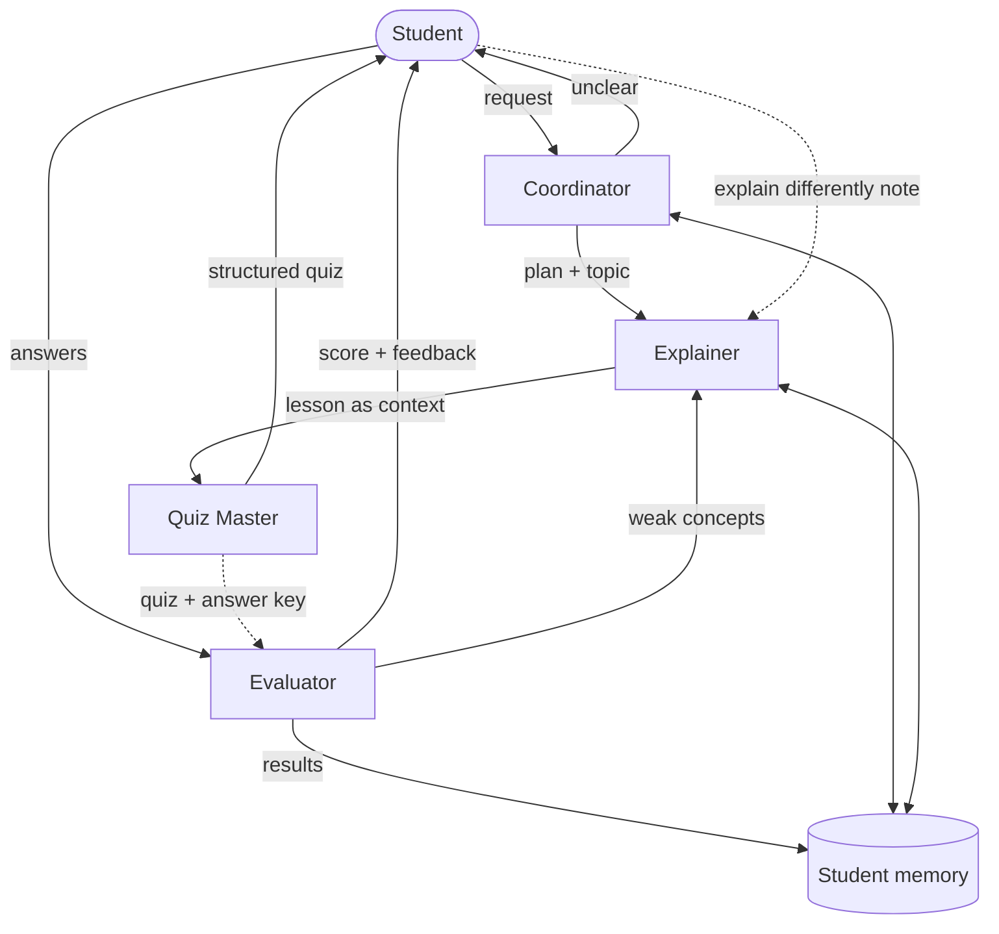

# Leo - Multi-Agent AI Tutor

Leo is a study assistant built from four collaborating CrewAI agents. The
student picks a topic; the agents plan, teach, quiz and give feedback, handing
work to each other along the way.

## Agents and roles

| Agent        | Role                                                           | Output                    |
|--------------|----------------------------------------------------------------|---------------------------|
| Coordinator  | Reads the request, asks a clarifying question if unclear,      | CoordinatorPlan (Pydantic)|
|              | plans the session, handles failures and fallbacks              |                           |
| Explainer    | Teaches the concept at the student's level; re-teaches weak    | Explanation (Pydantic)    |
|              | concepts differently                                           |                           |
| Quiz Master  | Builds multiple-choice questions from the lesson               | Quiz (structured)         |
| Evaluator    | Checks answers, explains mistakes, names weak concepts         | EvaluationResult          |

Each agent has its own role/goal/backstory and its own task prompt template in
config/prompts.py.

## Orchestration pattern

Coordinator-led sequential pipeline with a feedback loop.

1. Coordinator -> plan (or clarification question if the request is unclear)
2. Explainer -> Quiz Master (sequential crew; the lesson is passed to the Quiz
   Master through CrewAI task context)
3. Student answers the quiz (human step)
4. Quiz + answer key + student answers -> Evaluator
5. Feedback loop: weak concepts go back to the Explainer for re-teaching and a
   new quiz (max 3 rounds). The student can also intervene before the quiz by
   asking for a different explanation (human-in-the-loop).

## Architecture diagram

Export this diagram to docs/architecture.png (e.g. with mermaid.live).

## Memory and prompts

- memory/student_memory.py stores the student's name, recent topics, scores
  and weak concepts in data/student_memory.json. A short summary is injected
  into the Coordinator and Explainer prompts.
- config/prompts.py holds one prompt template per role.

## Error handling

- Each stage retries once; agents have max_iter and max_execution_time limits.
- Unclear or empty requests -> Coordinator asks a clarifying question.
- If planning fails, the Coordinator uses a rule-based fallback plan.
- If the Evaluator fails, the answer is graded from the answer key.
- Scores are computed in code, so grading stays reliable.

## Run it

    python -m venv .venv
    source .venv/bin/activate        # Windows: .venv\Scripts\activate
    pip install -r requirements.txt
    cp .env.example .env             # then add your API key
    streamlit run app.py

Python 3.10-3.12 recommended. No API keys are committed; .env is git-ignored.

## Project structure

    app.py                  Streamlit UI (shows which agent is working)
    agents/                 one file per agent
    tasks/                  one file per task
    crew/tutor_crew.py      CrewAI orchestration, retries, fallbacks
    models/schemas.py       Pydantic structured outputs
    memory/                 student memory
    config/prompts.py       prompt templates per role
    docs/architecture.png   architecture diagram

## Bonus features

- Feedback loop: Evaluator -> Explainer re-teaches weak concepts.
- Human-in-the-loop: the student can steer the Explainer mid-run.